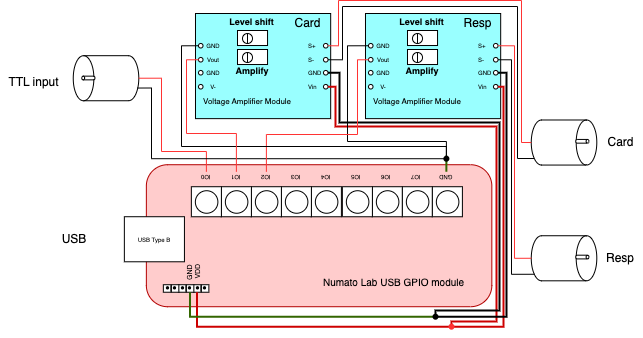
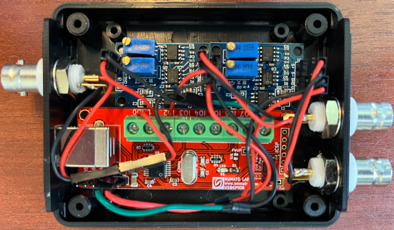

# Cardiogram, Respiration, and Scan Timing TTL Signal Recording

RTPSpy can apply RETROICOR noise regression in the RtpRegress module when it receives cardiogram and respiration signals in real-time.  
The 'RtpPhysio' class, defined in 'rtpspy/rtp_ttl_physio.py', records cardiogram and respiration signals in real-time and get_retrots() function in this function returns RETROICOR regressors. This module requires the input of a scan timing TTL signal to determine the scan onset timing within the cardiogram and respiratory signal series, allowing it to create a regressor corresponding to the current processing volume. The TTL signal can also be used to start the processing synchronized with the scan onset.

RtpPhysio currently supports two types of signal recorders:
* GE scanner devices whose signals are sent via a serial port.
* Analog input from BIOPAC devices received via [Numato 8 Channel USB GPIO Module](https://numato.com/product/8-channel-usb-gpio-module-with-analog-inputs/) device.

In either case, the TTL signal is received via the [Numato 8 Channel USB GPIO Module](https://numato.com/product/8-channel-usb-gpio-module-with-analog-inputs/) Module.  
Additionally, for simulation purposes, a dummy device that reads signals from existing files (text files) can also be used.

These devices are set by the device property of the RtpPhysio class as device='Numato' for the Numato USB GPIO, device='GE' for the GE scanner device, and device='dummy' for the dummy device.

## GE scanner devices whose signals are sent via serial port
Cardiogram and respiration signals from the GE scanner's pulse oximetry and respiration belt devices can be read in real-time via a serial port signal. The signals are encoded in bytestrings, and the RtpPhysio module decodes them to extract the signal values. There is a serial port on the scanner backend PC that can output the cardiogram and respiration signals. Please consult the vendor for details.

## Analog input from BIOPAC devices received via Numato USB GPIO device
BIOPAC devices can pass through the recording signal as analog outputs. RtpPhysio can receive these signals using the analog input channels of the Numato 8 Channel USB GPIO Module. However, the BIOPAC analog output ranges include both positive and negative voltages, and its amplitude could be fairly small, which might not be resolved well with the USB GPIO module since the module can acquire signals in the 0-5V range with a 10-bit resolution per sample (refer to [this](https://numato.com/docs/8-channel-usb-gpio-module-with-analog-inputs/#gpio-analog-inputs-9)). Therefore, level-shifting and signal amplification are needed to input and record the signals with this USB GPIO module.
To resolve this, we use the [Teyleten Robot Millivolt/Microvolt Voltage Amplifier Module](https://www.amazon.com/Teyleten-Robot-Millivolt-Microvolt-Instrumentation/dp/B08QM9SM1W/ref=asc_df_B08QM9SM1W/?tag=hyprod-20&linkCode=df0&hvadid=692875362841&hvpos=&hvnetw=g&hvrand=7701147929703361853&hvpone=&hvptwo=&hvqmt=&hvdev=c&hvdvcmdl=&hvlocint=&hvlocphy=9026564&hvtargid=pla-2281435178138&psc=1&mcid=10a44112c78335bfbd7e743d2fda9125&hvocijid=7701147929703361853-B08QM9SM1W-&hvexpln=73&gad_source=1) for level-shifting and signal amplification. The figure below shows a circuit diagram and a picture of the signal input device we made.  

To adjust the signal range, open the physiological signal monitor by running the rtpspy/rtp_physio.py script in the RTPSpy package.  
```
conda activate RTPSpy
~/RTPSpy/rtpspy.rtp_physio.py
```
Then, rotate the screws on the amplifier modules while monitoring the signal range. The upper screw is for level shifting, and the lower one is for signal amplification.




